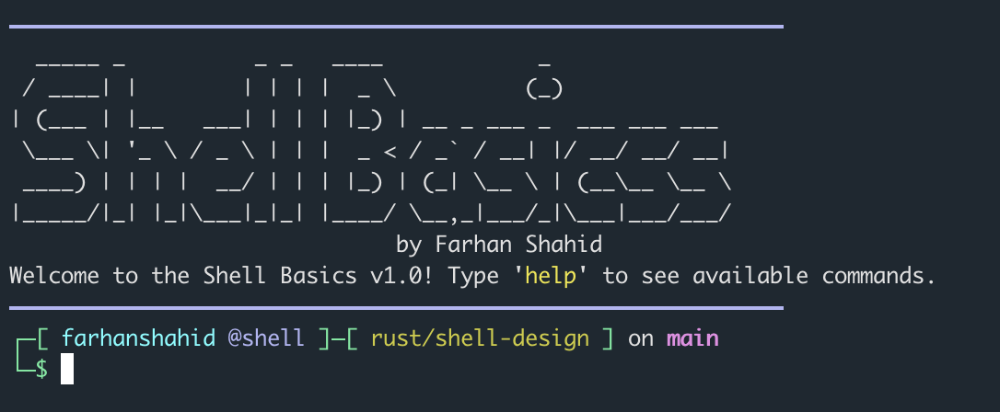

# Shell Basics by Farhan Shahid

A colorful, feature-rich shell implementation in Rust with useful file system operations and a beautiful terminal interface.



## Features

### File Operations
- `ls` - List files in current directory with color-coded types
- `ls -l` - Detailed file listing with permissions, size, and timestamps
- `pwd` - Print working directory
- `cd <directory>` - Change directory
- `touch <file>` - Create a new file or update timestamp
- `rm <file>` - Remove a file
- `cat <file>` - Display file contents with formatting

### Directory Operations
- `mkdir <directory>` - Create a directory
- `mkdir -p <directory>` - Create a directory and its parents
- `rmdir <directory>` - Remove an empty directory
- `rmdir -r <directory>` - Remove a directory and its contents

### File Management
- `cp <source> <dest>` - Copy a file
- `cp -r <source> <dest>` - Copy directory recursively
- `mv <source> <dest>` - Move/rename files or directories
- `stat <file/dir>` - Display detailed file or directory information
- `ln <target> <link_name>` - Create symbolic link

### Search and Information
- `find <dir> <pattern>` - Find files matching pattern
- `grep <file> <pattern>` - Search for pattern in file
- `echo <text>` - Print text to the terminal
- `exit` - Exit the shell
- `help` - Display help message with all available commands

## User Experience
- Colorful welcome banner with ASCII art
- Git branch detection in prompt
- Color-coded file listings by type
- Human-readable file sizes
- Detailed permissions display
- Error messages in red
- Success messages in green


## Implementation Details
- Written in Rust for performance and safety
- Asynchronous I/O with Tokio
- Error handling with anyhow
- Colored output using the colored crate
- File operations using Rust's std::fs

## Dependencies
- Tokio - Async runtime
- Anyhow - Error handling
- Chrono - Date and time handling
- Colored - Terminal coloring
- Filetime - File timestamp manipulation

## Running the Shell

To run the project, simply execute the following from the project directory:
```bash
cargo run
```

## Building from Source

```bash
# Clone the repository
git clone https://github.com/yourusername/shell-design.git
cd shell-design

# Build the project
cargo build

# Run the project
cargo run
```

## Help Section

The shell includes a comprehensive help system that displays all available commands organized by category:


## License

MIT License © 2025 Farhan Shahid

## Author

Farhan Shahid
